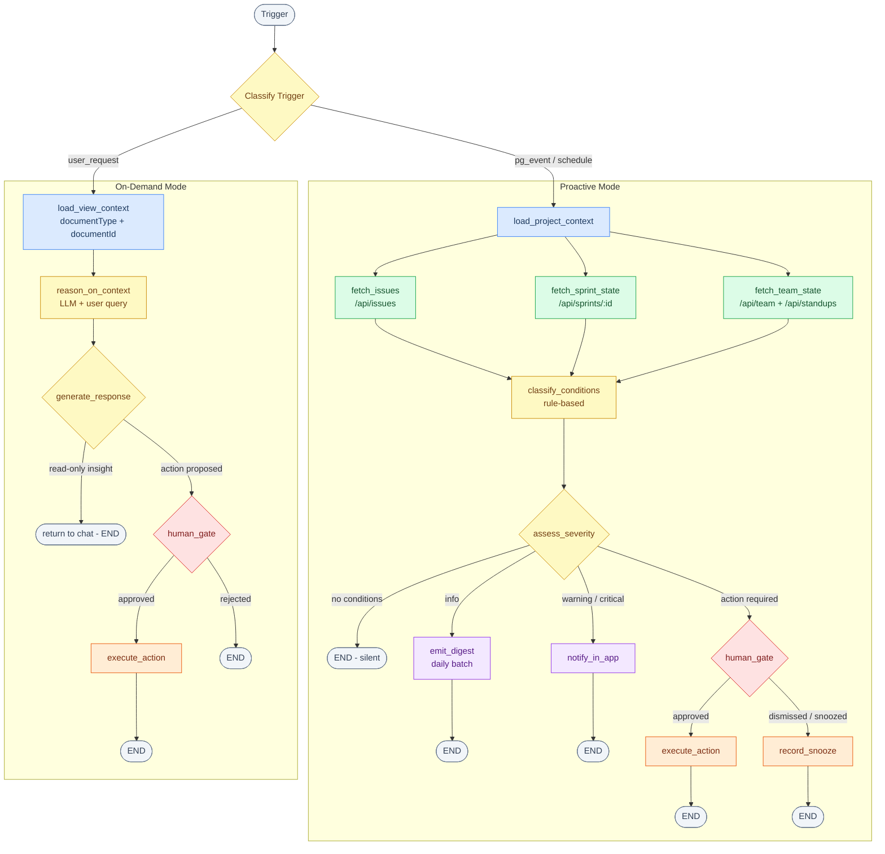

# FLEETGRAPH.md

*Submission template - filled in as the project is built.*

---

## Agent Responsibility

FleetGraph is a project intelligence agent embedded in Ship. It operates in two modes - proactive (agent pushes) and on-demand (user pulls) - both running through the same graph architecture.

### What it monitors proactively

FleetGraph watches the following conditions across all active projects and sprints:

| Condition | Detection rule |
|---|---|
| **Stale issue** | Issue has `started_at` set, sprint `status='active'`, and `state` has not changed for either 3+ days or more than 50% of the remaining sprint duration - whichever threshold is lower (threshold is immediate when remaining duration is 0 days; negative remaining duration does not auto-disable stale detection while sprint status remains `active`) |
| **Sprint scope creep** | A `document_association` with `relationship_type='sprint'` is created after the sprint's `start_date` |
| **Unresolved blocker** | Issue state is `blocked` or blocker language is detected in content/title (semantic variants allowed); escalate when unresolved for 24+ hours, where timer resets on `state` change or any new comment |
| **Orphaned issue** | Issue is in an active project/workspace context, has no sprint association, no `assignee_id`, `updated_at` > 7 days ago, and is not in terminal state (`done`, `closed`, `cancelled`) |

### What it reasons about when invoked on-demand

When a user opens the chat from within Ship, the agent is seeded with the context of the current view:

| View | Context loaded |
|---|---|
| Issue page | Issue document + last 30 days of history + sprint it belongs to + assignee profile |
| Sprint page | Sprint document + last 30 days of history + all associated issues with states + team capacity |
| Project page | Project document + last 30 days of history + active sprint + recent velocity + team members |
| Week page | Week document + last 30 days of history + all open issues for the team |

The agent uses this context as the starting point for reasoning about the user's question or requested action. It does not require the user to re-state what they are looking at.

### What it can do autonomously

- Post an in-app notification to the affected team member(s)
- Add a comment on an issue summarising the detected condition and a suggested next action
- Generate and deliver a daily sprint health digest to the project owner
- Log all detection events to `fleetgraph_runs` for audit and observability

### What must always require human confirmation

Any mutation to Ship data requires explicit human approval before the agent acts. No exceptions, regardless of mode (proactive or on-demand). This includes:

- Reassigning an issue to a different person
- Moving an issue from one sprint to another
- Changing issue state (closing, cancelling, re-opening)

Autonomous actions may create informational artifacts (`notifications`, `issue comments`, `fleetgraph_runs`) but may not mutate core planning fields (`assignee_id`, sprint associations, issue state, title/content/properties) without explicit human approval.

### Who it notifies and under what conditions

| Condition | Notified party | Condition to notify |
|---|---|---|
| Stale issue | Issue assignee | 3+ days without state change during active sprint, or stale threshold exceeded by remaining-sprint rule |
| Scope creep | Project owner (document creator) | Any post-start sprint association added |
| Unresolved blocker | Issue assignee; escalate to project document creator after 48h | 24h+ unresolved blocked issue (timer resets on state change or any comment) |
| Orphaned issue | Project owner; fallback to all workspace admins if owner missing/inactive | 7+ days with no assignee, no sprint, no activity; terminal-state issues excluded |

Deduplication: the agent deduplicates by `(entity_id, set_of_conditions)` for 48 hours, where `entity_id` is condition-specific (for example issue ID for stale/blocker/orphaned, sprint ID for scope creep). If the condition set changes (for example `{stale}` -> `{stale, blocker}`), it is treated as a new alert and bypasses dedup.

Worsening rules:
- Stale issue: crosses another full 24-hour bucket since last alert
- Scope creep: post-start addition count increases
- Unresolved blocker: crosses 48h then 72h since last qualifying activity
- Orphaned issue: crosses another full 7-day bucket

### How it knows who is on a project

Primary: query `document_associations` where `related_id = project_id` and `relationship_type = 'project'`. Each matched person document carries `properties->>'user_id'` linking to the `users` table.

Fallback: derive team membership from `assignee_id` fields on all issues associated with the project. Anyone assigned to a project issue is treated as a project member.

### How the on-demand mode uses context from the current view

The Ship frontend passes `{ documentType, documentId }` as part of the chat invocation payload. The agent's `load_view_context` node uses this to fetch and structure the full relevant context before any reasoning begins. The user never needs to explain what they are looking at - the agent already knows.

### Current Tool Catalog (Implemented)

FleetGraph currently supports the following on-demand tools (`api/src/fleetgraph/tools.ts`):

| Tool | Purpose | Type | Ask Permission Behavior | Authorization |
|---|---|---|---|---|
| `create_document` | Create a document by type/title | Mutation | Requires approval | Workspace member |
| `update_document` | Update document title/content | Mutation | Requires approval | Workspace member |
| `delete_document` | Soft-delete current document | Mutation | Requires approval | Workspace member |
| `delete_documents_by_title` | Bulk soft-delete docs by exact title | Mutation | Requires approval | Workspace member |
| `create_project` | Create project document | Mutation | Requires approval | Admin or super-admin |
| `update_project` | Update project title | Mutation | Requires approval | Workspace member |
| `archive_project` | Archive project document | Mutation | Requires approval | Admin or super-admin |
| `create_sprint` | Create sprint document with generated sprint number | Mutation | Requires approval | Admin or super-admin |
| `move_item_to_sprint` | Move issue into target sprint association | Mutation | Requires approval | Admin or super-admin |
| `close_sprint` | Mark sprint status as closed | Mutation | Requires approval | Admin or super-admin |
| `update_work_item_fields` | Update issue fields (currently status) | Mutation | Requires approval | Workspace member |
| `link_documents` | Create document association link | Mutation | Requires approval | Admin or super-admin |
| `unlink_documents` | Remove document association link | Mutation | Requires approval | Admin or super-admin |
| `bulk_edit_documents` | Batch update by title (e.g., archive) | Mutation | Requires approval | Admin or super-admin |
| `create_comment` | Add comment to current document thread | Mutation | Requires approval | Workspace member |
| `search_entities` | Unified search/list across docs/issues/projects/programs/sprints/workspaces; structured-first with fallback | Read | Executes without approval | Workspace member |
| `summarize_comment_thread` | Summarize recent comments on document | Read | Executes without approval | Workspace member |
| `get_timeline_changes` | Read recent workspace audit events | Read | Executes without approval | Workspace member |
| `validate_workspace_rules` | Compute workspace hygiene checks (untitled docs, orphan issues, stale docs) | Read | Executes without approval | Workspace member |
| `generate_sprint_review` | Generate sprint summary metrics from current data | Read | Executes without approval | Workspace member |
| `generate_project_health_report` | Generate project health metrics from current data | Read | Executes without approval | Workspace member |

Approval gate implementation detail: in `ask_permission` mode, only mutation tools require explicit approve/reject; read tools execute immediately.

---

## Graph Diagram

Both modes share the same graph. The difference is the entry trigger.



**Legend**

| Color | Node type |
|---|---|
| Blue | Context - loads and scopes data for the run |
| Green | Fetch - parallel API calls to Ship |
| Amber | Reasoning - classification, scoring, LLM calls |
| Purple | Output - notifications, digests, chat responses |
| Red | Gate - human-in-the-loop decision point |
| Orange | Action - mutations executed after approval |
| Gray | Terminal - entry and exit points |

### Node descriptions

| Node | Type | Description |
|---|---|---|
| `ingest_trigger` | Context | Receives and classifies the trigger - schedule tick, PG notification, or user invocation |
| `load_project_context` | Context | Resolves the project/sprint from the trigger payload; provides the fetch nodes' scope |
| `load_view_context` | Context | Fetches the full document context from the current Ship view (on-demand entry point) |
| `fetch_issues` | Fetch | Calls `/api/issues` filtered by project and active sprint |
| `fetch_sprint_state` | Fetch | Reads the sprint document's `properties` (dates, status, plan) and associations |
| `fetch_team_state` | Fetch | Calls `/api/team` and related team endpoints for current sprint health context (standup-specific detection is out of scope for MVP) |
| `classify_conditions` | Reasoning | Rule-based scan; emits a list of detected conditions with metadata |
| `assess_severity` | Reasoning | Scores each condition: `info`, `warning`, or `critical`; selects the routing branch |
| `emit_digest` | Output | Batches `info`-level findings for the end-of-day project summary |
| `notify_in_app` | Output | Posts a notification or comment to the affected user in Ship |
| `human_gate` | Gate | Interrupts execution; presents the proposed action to the human; waits for decision |
| `execute_action` | Action | Performs the human-approved mutation (reassign, move, state change) via Ship API |
| `record_snooze` | Action | Writes `snoozed_until` or `dismissed_at` to `fleetgraph_state` |
| `reason_on_context` | Reasoning | LLM call over the loaded view context and user's question |
| `generate_response` | Output | Produces structured output: findings summary + proposed actions (if any) |

---

## Use Cases

| # | Role | Trigger | Agent Detects / Produces | Human Decides |
|---|---|---|---|---|
| 1 | PM | Issue has `started_at` set but `state` has not changed in 3+ days during a sprint with `status='active'` | List of stale issues with days-since-state-change, current assignee, and draft reassignment suggestion | Whether to reassign, move to the next sprint, or accept the delay |
| 2 | PM / Director | New `document_association` with `relationship_type='sprint'` is created after the sprint's `start_date` | Scope growth percentage, list of post-start additions, estimated impact on projected sprint completion | Whether to remove the added issues or formally accept the scope change |
| 3 | Engineer (on-demand) / PM (proactive) | Issue content indicates semantic blocker language (for example "waiting on auth team") or state is `blocked`, and unresolved duration crosses threshold (24h+, with timer reset on state change or any new comment) | Blocking dependency candidate with confidence score, owner of blocking issue (if resolvable), days blocked, and draft escalation message | Whether to escalate to PM, reassign, or accept the block and adjust timeline |
| 4 | Director | Invoked from the sprint view at any time, or end-of-day proactive run during an active sprint | Sprint health score: completion rate vs. plan, at-risk issues, over-capacity team members, velocity trend vs. previous sprint | Whether to intervene (reprioritise, adjust capacity) or proceed with current trajectory |
| 5 | PM | Issues in active project/workspace context with no sprint association, no `assignee_id`, and `updated_at` > 7 days ago (excluding terminal states) | Grouped list of orphaned issues with suggested dispositions (archive, add to backlog, close) | What to do with each orphan - agent never moves or closes them without explicit approval |

---

## Trigger Model

**Decision: Hybrid - PostgreSQL LISTEN/NOTIFY as primary trigger, 5-minute scheduled poll as fallback.**

### Why not pure webhooks

Ship has no outbound webhook system. All change events are internal to the Node.js process (WebSocket collaboration + EventEmitter). Adding a webhook layer would require modifying Ship's core, which is out of scope. PostgreSQL LISTEN/NOTIFY achieves the same effect natively since FleetGraph shares the same RDS instance.

### Primary - PostgreSQL LISTEN/NOTIFY

A dedicated `pg.Client` in the FleetGraph service holds an open connection and issues:

```sql
LISTEN document_changes;
```

A trigger on the `documents` and `document_associations` tables fires `pg_notify('document_changes', payload)` on every INSERT and UPDATE. The payload carries `{ document_id, document_type, change_type }`. The FleetGraph service receives this notification in milliseconds and initiates a graph run for every document change (no relevance pre-filter in MVP).

Operational note: because every document change can trigger a run, FleetGraph uses a bounded worker queue with explicit max concurrency to avoid unbounded run storms; runs are processed FIFO once accepted into the queue.

### Fallback - 5-minute scheduled poll

A poll runs every 5 minutes (configurable via `FLEETGRAPH_POLL_INTERVAL_MS`, default `300000`):

```sql
SELECT id, document_type, updated_at
FROM documents
WHERE updated_at > $last_checked_at
ORDER BY updated_at DESC
LIMIT 200;
```

This catches changes that bypass the PG trigger (bulk migrations, direct DB writes, edge cases in test environments).

### Tradeoff comparison

| | Poll only | Webhooks | PG LISTEN + poll fallback |
|---|---|---|---|
| Detection latency | <= poll interval (~5 min) | Near real-time | <1s primary; <=5 min fallback |
| Idle cost | Constant (720 runs/project/day) | Zero | Near-zero (open connection, no LLM) |
| Reliability | High | Requires Ship changes | High - fallback covers all gaps |
| Implementation complexity | Low | Medium | Medium (PG trigger + listener) |

### Cost at scale

Because PG LISTEN only triggers graph runs on actual changes, the meaningful run rate is activity-driven, not time-driven. Estimate 20-50 graph runs per active project per day based on typical issue activity.

| Scale | Runs/day | Est. cost/day |
|---|---|---|
| 100 projects | ~3,500 | ~$0.35 |
| 1,000 projects | ~35,000 | ~$3.50 |
| 10,000 projects | ~350,000 | ~$35.00 |

*Assumes pricing based on `gpt-4o-mini` token rates from OpenAI pricing docs: input $0.15 / 1M tokens, output $0.60 / 1M tokens (source: [OpenAI API Pricing](https://platform.openai.com/docs/pricing/)).*

### Detection latency

- PG LISTEN path: trigger fires in <1s; parallel fetch + classify takes ~10-20s total -> well under 1 minute
- Fallback poll path: worst case 5 minutes + ~20s execution = ~5.3 minutes
- Both paths satisfy the <5 minute SLA required by the PRD

---

## Test Cases

*Due: Early Submission (Thursday, 11:59 PM). All 14 trace links captured May 31, 2026 via `/api/fleetgraph/test/run-case/:id` against the production Render deployment (`https://ship-api-ysxi.onrender.com`). All links are publicly accessible without login.*

| # | Ship State | Expected Output | Trace Link |
|---|---|---|---|
| 1 | Issue with `started_at` set 4 days ago, `state = 'in_progress'`, sprint is active with `end_date` 2 days away | Agent detects stale issue (4 days stale > 2 days remaining sprint time), posts in-app notification to assignee with days-stale count and sprint deadline | https://smith.langchain.com/public/e467cd7d-2dd9-4396-a56d-3d16fa6ed500/r |
| 2 | Sprint with `start_date` = 3 days ago; new `document_association` with `relationship_type='sprint'` created today | Agent detects scope creep, calculates % growth, notifies project owner with list of post-start additions | https://smith.langchain.com/public/c99e46a0-5e57-4418-9089-445b942a9827/r |
| 3 | Issue text says "waiting on auth team response", model confidence = 0.72 | Agent notifies assignee with explicit uncertainty ("possible blocker"), includes confidence, and requires human confirmation before any mutation proposal | https://smith.langchain.com/public/394cb98d-2772-4d73-ac49-695766a8a05a/r |
| 4 | Issue content contains "blocked by AUTH-42", state unchanged for 30 hours, then a new comment is added | Agent resets blocker timer on comment; no 48h escalation until threshold is crossed again | https://smith.langchain.com/public/8e6ed916-bf2c-462e-8fdc-86546b9f815e/r |
| 5 | User opens chat on a sprint page mid-sprint and asks "what's at risk?" | Agent loads sprint + associated issues + last 30 days of history, identifies at-risk issues, returns health summary in chat | https://smith.langchain.com/public/24f085de-c362-4ddf-ad20-05c7feb208b7/r |
| 6 | Three issues with no `assignee_id`, no sprint association, `updated_at` 10+ days ago; one is `closed` | Agent excludes closed issue, groups remaining orphans, suggests dispositions, and presents actions for explicit confirmation | https://smith.langchain.com/public/d02e6f93-6e3c-40e7-b52d-9f393d2feb6b/r |
| 7 | Same issue triggers stale detection twice within 48 hours with no worsening signal | Second run is deduplicated (no re-notification) and run log shows dedup reason | https://smith.langchain.com/public/60d009d4-770b-4d21-981c-9fc742f8d7b1/r |
| 8 | Same issue first triggers `{stale}`, then later triggers `{stale, blocker}` within 48 hours | Condition-set change bypasses dedup; new notification is sent with merged condition context | https://smith.langchain.com/public/79a181f5-1edd-4dc1-90a9-28fc495a08a7/r |
| 9 | One issue triggers both notification-only condition and action-required condition in same proactive run | Notification is emitted immediately; action proposal is emitted separately behind human gate | https://smith.langchain.com/public/4af10a73-3806-4890-ac25-fcab227f656d/r |
| 10 | User requests "move these 4 issues to next sprint" from chat | Agent creates per-item confirmation flow because total mutations >= 3; no mutation occurs before explicit approvals | https://smith.langchain.com/public/70f473be-5097-4494-ad40-3dd44202b0ae/r |
| 11 | User approval card for proposed reassignment sits for >24h without response | Approval expires, requester receives expiry notification, and action is not executed | https://smith.langchain.com/public/23dbb468-f822-4975-a695-95cd32c0a82d/r |
| 12 | User rejects a proposed action, then no material state change occurs for the issue | Agent forgets rejected proposal state and does not re-propose until a qualifying material state change happens | https://smith.langchain.com/public/e0f3acbb-11bd-4ca8-ae44-4d5909e3e4bc/r |
| 13 | On-demand query asks about issue history where relevant event is 45 days old | Agent limits context to last 30 days, states findings based on in-window data only, and does not fetch older history | https://smith.langchain.com/public/8753931a-f141-4d8e-86bb-949c70d99acc/r |
| 14 | Burst of document edits causes many PG notifications in short interval | Runs enter bounded FIFO queue; system processes without crash and preserves detection latency target where feasible | https://smith.langchain.com/public/2fa9b0cb-3ef7-4333-ab5a-57d306ecad3b/r |

---

## Architecture Decisions

*Due: Early Submission (Thursday, 11:59 PM). To be expanded after implementation begins.*

| Decision | Choice | Rationale | Tradeoff |
|---|---|---|---|
| Graph framework | Custom TypeScript graph runner | TypeScript - stays in the Ship monorepo; manual LangSmith REST instrumentation via `langsmith.ts` (`createLangSmithChildRun` / `finishLangSmithChildRun`); no language boundary between Ship and FleetGraph | LangGraph.js would provide built-in tracing and a richer node/edge API but adds an external dependency; the custom runner is simpler and sufficient for the current graph shape |
| Trigger mechanism | PG LISTEN/NOTIFY + poll fallback | Ship has no webhook system; PG events are real-time and require no Ship modifications; poll provides resilience | Requires the agent service to maintain a persistent DB connection |
| Deployment | In-process on Render (same service as the API) | FleetGraph runs as an in-process module within the Express API on Render; no separate worker service or EB environment; the trigger runtime and graph runner start alongside the server | Long-running graph executions share the web-serving process; a future high-load deployment could extract this to a dedicated worker, but in-process is sufficient for MVP |
| LLM choice | `gpt-4o-mini` | Balances quality, latency, and cost for both proactive and on-demand agent flows | Lower ceiling than larger frontier models for hardest reasoning tasks |
| Authentication | `fleetgraph-service` API token via `/api/api-tokens` | No user session required; already supported by Ship's auth layer | Token must be rotated and secured as an env variable; cannot impersonate individual users for write actions |
| State persistence | `fleetgraph_state` PostgreSQL table | Shares the existing RDS instance; no new infrastructure; survives service restarts | Same DB as production - migrations must be handled carefully |
| Human-in-the-loop surface | In-app notification banner + chat confirm card | Both paths surface in the Ship UI the user already has open; no external channel needed for MVP | Users who are not in Ship when a gate fires will not see it until they return |
| On-demand history scope | Last 30 days (strict cap) | Controls prompt size, latency, and cost while retaining recent operational context | Older but potentially relevant events are intentionally ignored in MVP |
| Approval TTL | 24 hours with expiry notification | Prevents stale approvals; keeps decisions close to current state | Requires re-proposal when approval expires |
| Rejection behavior | Forget on reject; no stored suppression | Keeps behavior simple and user-driven in MVP | Same action may reappear on future events |
| Cross-origin FleetGraph API routing | Use shared `apiGet`/`apiPost` client for all FleetGraph routes | Ensures requests target configured API origin in production (Render split-host setup) | Requires consistent API-client usage; direct relative `fetch('/api/...')` is unsafe in split-origin deployments |

---

## Cost Analysis

### Development and Testing Costs

| Item | Amount |
|---|---|
| LLM API - input tokens | 22,400,000 |
| LLM API - output tokens | 3,360,000 |
| Total graph agent invocations during development | 8,000 |
| Total development spend | $7.00 |

Development cost basis: 8,000 total graph agent invocations across the build week with a 70/30 proactive/on-demand split — 5,600 proactive runs averaging 2,500 input + 300 output tokens, and 2,400 on-demand runs averaging 3,500 input + 700 output tokens. Priced at `gpt-4o-mini` rates (input $0.15/1M tokens, output $0.60/1M tokens) from [OpenAI API Pricing](https://platform.openai.com/docs/pricing/). $7.00 figure includes a 30% overhead buffer for retries, prompt growth, and non-happy-path runs.

### Production Cost Projections

| 100 Users | 1,000 Users | 10,000 Users |
|---|---|---|
| ~$85/month | ~$852/month | ~$8,521/month |

**Assumptions (to be validated after first real runs):**

- Proactive runs per active project per day: 35 (activity-driven via PG LISTEN)
- On-demand invocations per user per day: 3
- Average tokens per proactive run: ~2,800 (2,500 input + 300 output)
- Average tokens per on-demand chat: ~4,200 (3,500 input + 700 output)
- Cost per proactive run (`gpt-4o-mini`): ~$0.00056
- Cost per on-demand chat (`gpt-4o-mini`): ~$0.00095
- Estimated proactive runs per day at 100 projects: ~3,500
- Estimated on-demand chats per day at 100 users x 3: ~300

**Cost math (based on current `gpt-4o-mini` rates):**

- Rate source: [OpenAI API Pricing](https://platform.openai.com/docs/pricing/)
- Input rate: $0.15 / 1,000,000 tokens
- Output rate: $0.60 / 1,000,000 tokens
- Proactive run calculation:
  - Input: `(2,500 / 1,000,000) * 0.15 = $0.000375`
  - Output: `(300 / 1,000,000) * 0.60 = $0.000180`
  - Total: `$0.000555` (~$0.00056)
- On-demand chat calculation:
  - Input: `(3,500 / 1,000,000) * 0.15 = $0.000525`
  - Output: `(700 / 1,000,000) * 0.60 = $0.000420`
  - Total: `$0.000945` (~$0.00095)

**Monthly projection math (30-day month):**

- 100 users/projects baseline:
  - Proactive/day: `3,500 * $0.000555 = $1.9425`
  - On-demand/day: `300 * $0.000945 = $0.2835`
  - Total/day: `$2.226`
  - Total/month: `$66.78` (~$67)
- Table values above (~$85 / ~$852 / ~$8,521 per month) include a ~27.5% overhead factor for retries, prompt growth, and non-happy-path runs to avoid under-budgeting early production.
