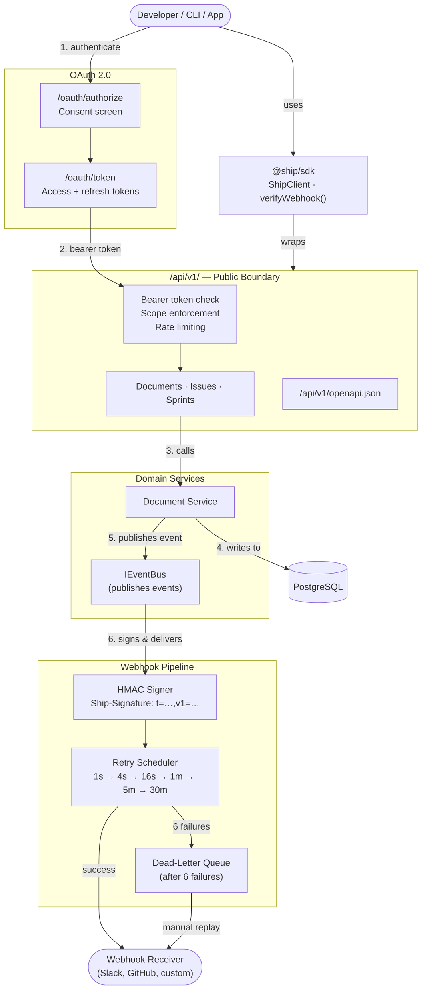

# PlugForge — Basic Flow

## Flow in plain English

1. **Authenticate** — the app goes through OAuth (`/oauth/authorize` → `/oauth/token`) and receives a scoped bearer token. CLI uses Device Flow; web apps use Auth Code + PKCE.
2. **Call the public API** — every request to `/api/v1/*` passes through bearer token validation, scope enforcement, and rate limiting before reaching a resource handler.
3. **Domain work** — the resource handler delegates to an internal domain service (e.g. Document Service) which reads/writes PostgreSQL.
4. **Event published** — on any write, the domain service publishes an event onto `IEventBus` (never the route layer).
5. **Webhook delivery** — the event is matched to subscriptions, HMAC-signed (Stripe-style `Ship-Signature` header), and delivered with exponential-backoff retries. After 6 failures, the delivery lands in the Dead-Letter Queue for manual replay.
6. **SDK** — `@ship/sdk` wraps the public API so consumers never call raw HTTP. `verifyWebhook()` lets receivers verify signatures in one line.
