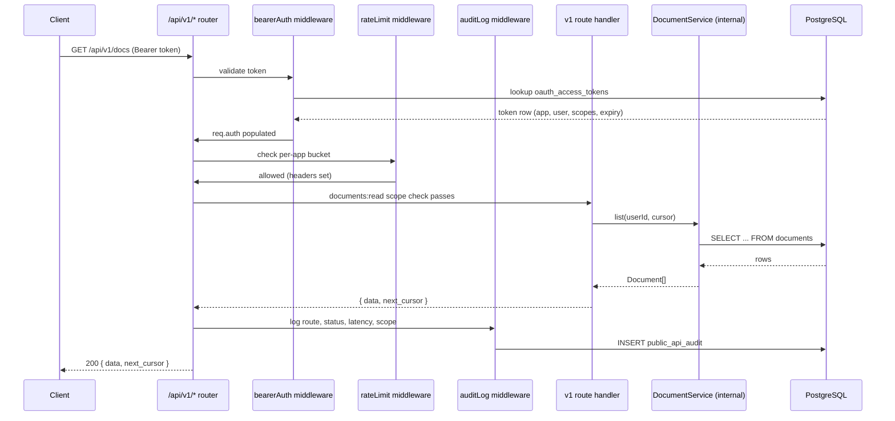
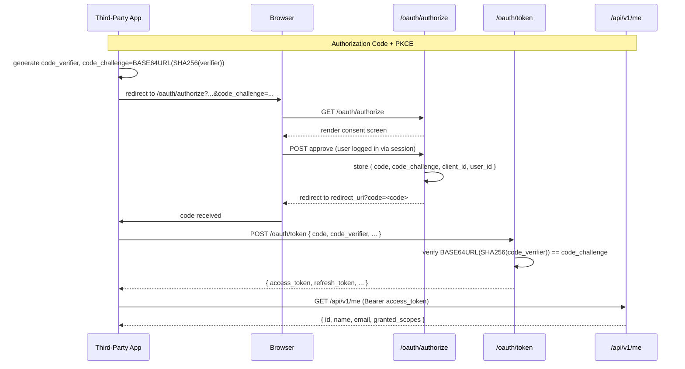
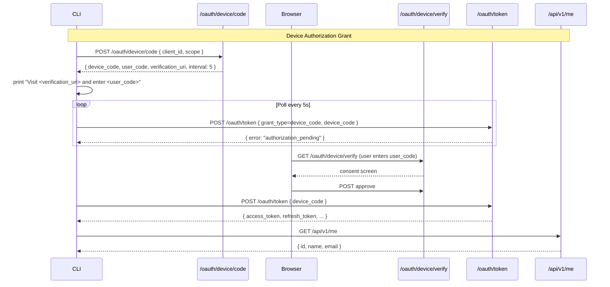
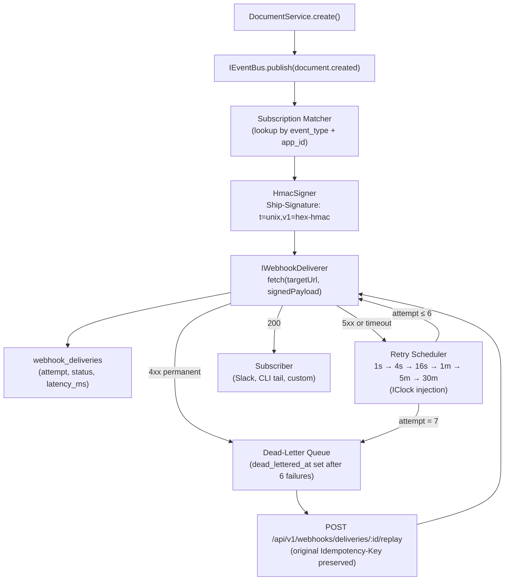
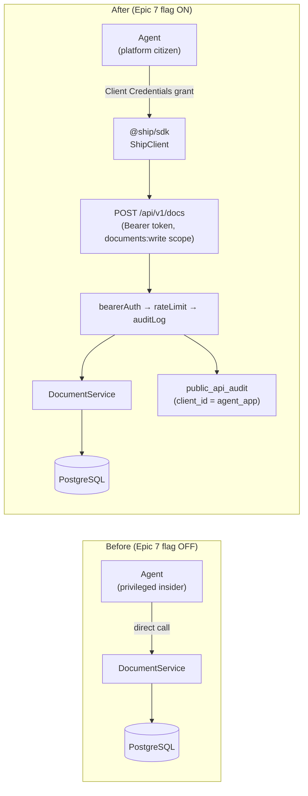

# PLUGFORGE-PLAN.md
## Architectural Plan — Developer-First Platform on Ship

> "Complete this before writing code." — PRD Pre-Search instruction
>
> This document answers all three phases of the PRD Pre-Search checklist, records every architectural decision that must be locked before the first commit, and provides the system-level design that PLUGFORGE-TASKS.md executes against.

---

## PRD Requirements

### MVP — Hard Gate

> All items required to pass. None optional.

- [ ] **OAuth app registration** — admin can create an app, receive `client_id` and `client_secret`; secret hashed in DB, raw value shown exactly once on creation.
- [ ] **Auth Code + PKCE end-to-end** — Playwright test drives `/oauth/authorize` → consent → `/oauth/token` → usable access token. Wrong `code_verifier` returns `invalid_grant` (negative case mandatory).
- [ ] **Bearer token middleware** — validates tokens on every `/api/v1/*` route. Invalid → 401. Missing → 401. Expired → 401 with a distinct error code.
- [ ] **Documents resource** — `GET /api/v1/docs`, `GET /api/v1/docs/:id`, `POST /api/v1/docs`. Each route declares its required scope via a `requireScope()` middleware factory.
- [ ] **Consistent ApiError shape** — `{ code, message, details?, request_id }` on every public failure. A fitness test enumerates all `/api/v1` routes and asserts the shape on every failure path.
- [ ] **ScopeRegistry** — scopes-as-data. Insufficient scope returns 403 with the missing scope named explicitly in the body (no opaque "forbidden").
- [ ] **OpenAPI 3.1 spec** — served at `/api/v1/openapi.json`, generated from route metadata (never hand-written), validated against the OpenAPI schema in a unit test.
- [ ] **SDK skeleton** — `@ship/sdk` workspace package exists. `new ShipClient({ token }).me()` against a running server returns the typed authenticated user.
- [ ] **Regression gate** — existing Playwright suite passes on main. P95 latency, bundle size, and per-route query counts within +10% of Part 1 baseline.
- [ ] **Deployed + publicly accessible** — Ship deployed, OpenAPI spec URL published, at least one OAuth app pre-registered with read-only scopes for graders.

---

### Final Submission — Full Checklist

> Deadline: Sunday 11:59 AM CT

**Deliverables (all required):**

- [ ] **GitHub repository** — public; per-slice branches preserved; each PR description lists which acceptance criterion it advances and confirms the fitness test passed.
- [ ] **Demo video (3–5 min)** — the five-line story: fresh terminal → `pnpm install @ship/sdk` → `ship login` → `ship docs create` → `ship webhooks tail` → verified signed delivery arrives. Then switch to dev portal and replay one delivery.
- [ ] **Pre-Search document** — all three phases completed with written answers; saved AI conversation attached as a reference artifact.
- [ ] **Architecture document** — 1–2 pages committed at `docs/architecture.md`, covering all 8 sections (module layout, SOLID rationale, composition root, public/internal boundary, OAuth flows, webhook pipeline, SDK surface, agent-as-citizen, failure modes).
- [ ] **OpenAPI spec** — live at `/api/v1/openapi.json` on the deployed instance + static copy at `docs/openapi.json` in the repo. Validated against the OpenAPI schema.
- [ ] **AI cost analysis** — tracked dev spend, production projections table, explicit assumptions for webhook fanout ratio, agent active rate, and storage retention.
- [ ] **Per-Epic write-up** — before → fix → after → proof for each epic. Epic 6 proof = TTFE drill passing in CI. Epic 7 proof = agent audit-log rows showing OAuth app authentication.
- [ ] **Three Discoveries** — written up. Strong candidates: OAuth Device Authorization Grant in TypeScript, Zod-driven OpenAPI generation with fitness-test parity, Stripe-style HMAC + timestamp anti-replay, async-iterator pagination as a DX pattern.
- [ ] **Deployed application** — public URL with pre-registered OAuth app (read-only scopes) for graders, credentials in README. Dev portal reachable; OpenAPI spec resolvable.
- [ ] **Social post** — tag `@GauntletAI`. Screenshot = `ship webhooks tail` terminal showing a verified signed event arriving in real time.

**Reference integrations — implement at least 5 total (CLI is must-ship):**

- [ ] **CLI tool** *(must-ship)* — `ship login` (device flow), `ship docs ls/get/create`, `ship webhooks tail` — tasks: E11
- [ ] **Slack integration** *(should-ship)* — receives signed webhooks, posts `document.created` and `issue.assigned` to channels via Slack OAuth — tasks: F6d
- [ ] **Browser SDK demo** — Auth Code + PKCE in a single-page app that lists the user's documents — tasks: F6c
- [ ] **GitHub integration** — links Ship issues to GitHub PRs via webhook + GitHub App — tasks: F6
- [ ] **Refresh-token rotation drill** — proves a stolen refresh token invalidates the entire family — tasks: F6a
- [ ] **Idempotency-Key end-to-end** — replay drill confirms subscribers correctly dedupe on replayed deliveries — tasks: F6b
- [ ] **In-process plugin runtime** *(stretch)* — isolated-vm with one hook (`document.beforeCreate`) and a hard CPU/memory cap; explicitly experimental

**Performance targets (all must pass):**

| Metric | Target |
|---|---|
| Time-to-First-Event (clean machine, docs only) | ≤ 30 min real elapsed |
| TTFE drill in CI (P95) | < 60s |
| OAuth Auth Code + PKCE round-trip (P95) | < 3s |
| Webhook delivery latency (P95, first attempt) | < 2s |
| Webhook signature verification (SDK helper) | < 1ms per call |
| OpenAPI spec parity (fitness test) | 100% — no drift |
| Public API responses with rate-limit headers | 100% |
| SDK install size (prod deps, minified + gzipped) | < 250 KB |
| Drill flake rate over 20 consecutive CI runs | 0% |
| Regression vs Part 1 baseline | ≤ +10% on P95, bundle size, query counts |

---

## Pre-Search Phase 1 — Constraints

### 1.1 Scale & Load Expectations

**Demo-window API rate:** One grader session ≈ 20–50 req/min. The in-memory token bucket (1 000 req/min default) comfortably handles this; no Redis needed for demo.

**Webhook fanout ratio:** Each write event (document.created, issue.assigned, etc.) fans out to N matching subscriptions. For demo, seed 2–3 subscriptions per event type, so fanout ≤ 3 per write. The in-memory deliverer handles this synchronously without backpressure.

**Delivery log row growth:** At demo volume (≈ 50 events × 3 subscriptions × up to 6 retry attempts) = ~900 rows maximum per demo run. Negligible. Retention window = 30 days (configurable via `WEBHOOK_DELIVERY_RETENTION_DAYS`).

**Concurrent Device Flow sessions:** Demo = 1–3 concurrent CLI sessions. Polling interval = 5s; slow_down bumps interval to 10s. No concurrency issue with in-memory device code store.

**In-memory deliverer headroom:** Drops below the < 2s P95 target at approximately 100+ concurrent deliveries per second. Well above demo load. Document this ceiling explicitly in `docs/architecture.md`.

---

### 1.2 Budget & Cost Ceilings

**CI minutes per PR:** Each PR runs:
- TTFE drill: ~15–30s
- OAuth Playwright flow (2 flows × ~10s): ~20s
- Full Vitest suite: ~30s
- Total per PR: ≈ 90s — budget at 3 min/PR, ~$0.005/PR on GitHub Actions.

**SDK install footprint:** Target < 250 KB minified + gzipped (PRD hard limit). Enforce with a `size-limit` check in CI (`package.json` `size-limit` field). Zero heavy runtime deps — no axios, no lodash.

**Webhook queue runaway ceiling:** In-memory deliverer: cap the in-flight queue at 500 pending deliveries. Beyond that, new deliveries are dead-lettered immediately with `reason: "queue_full"`. Prevents unbounded memory growth during demo.

**LLM spend (Epic 7 rewire):** Zero additional LLM tokens — the rewire replaces direct service calls with SDK calls, same agent logic. Verify with a before/after token count assertion in the agent test suite.

---

### 1.3 Timeline & Scope Reality

**Must-ship epics (non-negotiable) — PRD Epic numbering:**
- Epic 1: Auth Code + PKCE (tasks: E1)
- Epic 2: Device Authorization Grant (tasks: E2)
- Epic 3: Public API boundary + bearer middleware (tasks: M2, M4)
- Epic 4: Documents resource + OpenAPI spec (tasks: M5, M6)
- Epic 5: SDK skeleton → full SDK (tasks: M7, E10)
- Epic 6: CLI — `ship login`, `ship docs create`, `ship webhooks tail` (tasks: E11)
- Epic 7: Webhooks end-to-end + agent rewire (tasks: E6, E7, F4)

**Should-ship (cut if time-constrained):**
- Developer portal UI — minimum viable = read-only delivery log view (tasks: F3)
- Refresh token rotation drill (tasks: E3)
- Slack integration (tasks: F6d)

**Kill criterion for developer portal:** If the full portal takes more than 4 hours, ship a read-only delivery log view at `/developer` — one table, no forms. The portal "eats its own dog food" requirement is still satisfied by a read-only view.

**Day-by-day sketch (references PLUGFORGE-TASKS.md task IDs):**
- Day 1: M1–M4 (OAuth foundation + boundary + error shape + bearer middleware)
- Day 2: M5–M8 (documents resource, OpenAPI, SDK skeleton, deploy)
- Day 3: E1–E3 (full PKCE flow, device flow, refresh rotation)
- Day 4: E4–E6 (remaining resources, webhooks pipeline end-to-end)
- Day 5: E7–E11 (retry/DLQ, rate limit, audit, full SDK, CLI)
- Day 6: F1–F3 (TTFE drill, SSE tail, portal)
- Day 7: F4–F7 (agent rewire, architecture docs, submission)

---

### 1.4 Security & Data Sensitivity

**`client_secret` at rest:** bcrypt, cost factor 12, random salt per secret. Not recoverable — only rotation creates a new one. The raw secret is returned in the API response body exactly once and never logged.

**Access token TTL:** 15 minutes. Refresh token TTL: 90 days. Refresh tokens are single-use with rotation (Task E3).

**Stolen refresh token detection:** On reuse of a consumed refresh token, the entire `family_id` is invalidated. All access tokens issued from that family become invalid on their next use (checked at bearer validation time via a `revoked_families` set in the token store).

**Webhook payload content:** Ship only the event metadata + document/issue ID, not the full document content. Rationale: reduces exposure surface; subscribers fetch content on demand via the SDK if needed. Document this decision in `docs/architecture.md`.

**Developer portal secret display:** The shown-once modal uses a `<dialog>` element with `autofocus` on the "Copy" button. The secret is served in the POST response body only — never in a GET response, never in a URL, never in a log line. The modal sets `data-secret` only in memory (React state), not in the DOM after close.

**CSRF protection:** The developer portal form endpoints (app registration, secret rotation) are called with the session cookie + a CSRF token (existing Ship `csrf-sync` middleware). The OAuth consent screen (`/oauth/authorize POST`) is exempt from CSRF because it uses `state` parameter validation per RFC 6749 §10.12. The consent screen sets `X-Frame-Options: DENY` to prevent clickjacking.

---

### 1.5 Team Skill Inventory

- OAuth 2.0 consumed before, implementing from scratch — read RFC 6749 + 7636 + 8628 on Day 1 morning before touching E1.
- Zod + `@asteasolutions/zod-to-openapi` — new dependency; fallback is `zod-to-openapi` package if the Asteasolutions one breaks.
- SDK design — hand-written for type quality, fitness-tested for parity drift. Async-iterator pagination modeled after the `@anthropic-ai/sdk` page iterator pattern.

---

## Pre-Search Phase 2 — Architecture Decisions

### 2.1 OAuth Flow Choices

| Decision | Choice | Rationale |
|---|---|---|
| Refresh tokens from day one | Yes | Migration cost is high if added later — token table schema must support `family_id` from the start |
| Scope upgrades | No incremental consent | Re-consent required for new scopes. Simpler model; acceptable for demo week |
| Consent screen location | Route inside Ship's UI at `/oauth/authorize` | Reuses existing session auth; minimal new surface. Protected by `X-Frame-Options: DENY` |
| Device Grant verification UX | User pastes code into a form at `/oauth/device` | RFC 8628 allows both; form is simpler to implement and test than auto-approving a URL-embedded code |
| Agent OAuth grant type | Client Credentials (RFC 6749 §4.4) | Agent is a first-party server-side process — no human in the loop, no browser. Client Credentials is the correct M2M flow |
| Agent app seeding | Migration `062_agent_oauth_app_seed.sql` | Guaranteed present in all environments including prod deploys. Not a runtime seed script |

---

### 2.2 Public API Shape

| Decision | Choice | Rationale |
|---|---|---|
| Error shape consistency | One shape across all routes, `details` may be richer | Fitness test asserts the base keys on every route; `details` is `Record<string, unknown>` so routes can add context without breaking the contract |
| Field-level filtering | Skip for the week | YAGNI — adds spec complexity for zero demo value |
| Versioning policy past `/v1/` | Additive changes only in `/v1/`; breaking changes via `/v2/` | Document in `docs/architecture.md` and the OpenAPI spec `info.description` |
| Cursor pagination scope | All list endpoints except `/api/v1/scopes` (static list of 7 items) | Fitness test knows: routes tagged `list: true` in `registerRoute()` must return `{ data, next_cursor }` |
| `/api/v1/me` token requirement | User-context tokens only (Auth Code or Device Grant). Client Credentials tokens receive 403. | Machine tokens have no user identity. FleetGraph never calls `/me` — it knows its own identity. Documented in OpenAPI spec. |

---

### 2.3 Webhook Reliability

| Decision | Choice | Rationale |
|---|---|---|
| What is signed | `t=<unix>` + `.` + raw JSON body string | Same scheme as Stripe. Concatenation prevents length-extension attacks; timestamp prevents replay |
| 4xx vs 5xx permanence | 4xx = permanent (except 429), 5xx = transient, 429 = transient (subscriber overloaded) | 410 Gone is permanent. 429 is transient — subscriber is alive but busy |
| Retry schedule testing | `IClock` interface injected into deliverer | `FakeClock` in tests advances time deterministically. Zero `setTimeout` in test code |
| Idempotency-Key origin | Generated at first delivery attempt as `crypto.randomUUID()`. Carried on replays unchanged | Contract for subscribers: same key = same event. Document deduplication window as subscriber's responsibility |
| Delivery semantics | At-least-once | Simpler than exactly-once; idempotency key gives subscribers the tool to dedupe |

---

### 2.4 SDK Design

| Decision | Choice | Rationale |
|---|---|---|
| Generated vs. hand-written | Hand-written, parity-tested against spec | Generated SDKs from OpenAPI have poor TypeScript ergonomics (no async iterators, weak discriminated unions). Fitness test catches drift without giving up quality |
| Error model | Typed discriminated union (`ShipError`) | Most TypeScript-native — `switch (e.kind)` exhaustively handles all cases. No Result-type wrapper (adds friction for most consumers) |
| Pagination | Async-iterator only | Cleaner consumer API. Raw cursor access available via `.list()` if needed for advanced use cases |
| `ITokenStore` contract | Stores both access and refresh tokens. Single mutex for refresh under concurrent calls | Prevents thundering-herd refresh: first concurrent caller holds the lock, rest wait and receive the new token |

---

### 2.5 Developer Portal

| Decision | Choice | Rationale |
|---|---|---|
| Public API or internal endpoint | Public API only (`/api/v1/`) | Eats own dog food — proves the API surface is complete. No internal escape hatch |
| `client_secret` rotation model | Old secret immediately invalidated on rotation | Stripe does a grace period; we skip it for simplicity. Document the "rotate and redeploy immediately" operational requirement |
| Delivery log scale | Server-side cursor pagination via the existing `GET /api/v1/webhooks/deliveries` | Build-cheap. Virtualized list is rebuild-cheap later if needed |
| Webhook payload display | ID + event type only, no payload body | Consistent with the webhook payload decision in §1.4. Reduces leakage surface |

---

### 2.6 Agent-as-Citizen Rewire

| Decision | Choice | Rationale |
|---|---|---|
| OAuth grant type | Client Credentials (`grant_type=client_credentials`) | Agent is server-side, non-interactive, first-party. No PKCE dance needed |
| Agent app seeding | Migration `062_agent_oauth_app_seed.sql` — seeds both the OAuth app AND a system user `{ name: "FleetGraph", email: "fleetgraph@ship.internal" }` | Client Credentials tokens issued to the agent app carry `user_id = system_user.id`. Comments, audit rows, and `created_by` fields show "FleetGraph" — no null authorship, no UI changes needed. |
| Agent scopes | `documents:read`, `documents:write`, `issues:read`, `issues:write` | Minimum necessary. No `webhooks:manage` — agent does not manage subscriptions |
| Feature flag | `AGENT_USE_PUBLIC_API=true` env var, checked at agent service composition root | Both paths tested in CI. Flag off = Part 2 tests unchanged. Flag on = audit log proof |
| CI proof | Run agent test suite with flag on, grep `public_api_audit` for agent `client_id` rows | Zero rows with `client_id = null` after an agent turn proves no internal bypass |

---

## Pre-Search Phase 3 — Post-Stack Refinement

### 3.1 Security & Failure Modes

| Failure | Response |
|---|---|
| OAuth app owner deleted | App set to `deactivated = true`. All tokens for that app rejected at bearer validation. No orphan tokens remain active |
| Webhook deliverer crashes mid-batch | In-memory deliverer: deliveries in flight are lost. At-least-once guarantee means they are NOT retried automatically after restart (in-memory state gone). Document: production upgrade path is BullMQ + Redis, which survives restarts |
| Leaked `client_secret` | Owner rotates via portal. Old hash immediately invalidated. Audit log entry with `event: secret_rotated` is the alert signal |
| CSRF on portal forms | `csrf-sync` middleware already in Ship. Portal forms include `X-CSRF-Token` header. OAuth consent screen uses `state` parameter validation instead |
| OpenAPI generator throws at boot | Wrapped in a try/catch in `app.ts`. On failure: server boots but `GET /api/v1/openapi.json` returns 503 with `{ code: "server_error", message: "OpenAPI spec unavailable" }`. CI fitness test catches this before deploy |

---

### 3.2 Testing Strategy

| Concern | Approach |
|---|---|
| OAuth Playwright test stability | Ship runs its own auth — no external IdP. Tests run against the local Express server. No Keycloak/Auth0 stub needed. Playwright launches a real browser against the dev server |
| Webhook retry schedule without sleeping | `IClock` interface on the deliverer. `FakeClock.advance(ms)` in tests. Retry loop calls `clock.now()` instead of `Date.now()` |
| TTFE drill in CI | `SHIP_DEVICE_CODE` env var set by `onUserCode` callback. Server auto-approves device codes matching this env var. No browser needed in CI for the device flow |
| OpenAPI fitness test CI wiring | Fail the build on any drift. Additive changes (new route registered but missing spec entry) = build failure. No "warn and post diff" — contract discipline requires hard failure |
| +10% regression budget | `performance-baseline.json` committed to repo. CI job runs the full E2E suite and compares P95, bundle size (`webpack-bundle-analyzer` or Vite's `--report`), and per-route query counts (existing `query-audit` middleware). Fails PR if any metric exceeds baseline × 1.10 |

---

### 3.3 Tooling & CI

**Boundary lint rules (two rules, both required):**
1. `no-restricted-imports` in `api/src/platform/api/v1/**`: forbids importing from `../../routes/**` and `../../services/**`.
2. `no-restricted-imports` in `integrations/**`: forbids importing from `../../api/src/**`. Only `@ship/sdk` allowed.

Both rules added to `.eslintrc.json` (or `eslint.config.js`) before any cross-imports exist. Enforced in the `pnpm lint` CI step.

**CI job order:**
```
lint → type-check → unit tests → build → OpenAPI fitness → TTFE drill → Playwright E2E → performance regression check
```

Each step is a prerequisite for the next. The TTFE drill runs after build so the CLI is compiled.

---

### 3.4 Deployment & Hosting

**Deployed instance:** Elastic Beanstalk (existing Ship deployment via `./scripts/deploy.sh prod`).

**Grader access:** A post-deploy seed script creates one read-only OAuth app (`documents:read`, `issues:read`) and prints the `client_id` and a pre-issued access token. These go into the `README.md` under "Grader Credentials". The seed script is idempotent — running it twice is safe.

**OpenAPI spec:** Served live at `/api/v1/openapi.json`. Static copy at `docs/openapi.json` generated via `curl <prod>/api/v1/openapi.json > docs/openapi.json` post-deploy and committed. A Redoc or Swagger UI page at `/api/v1/docs` (HTML, no auth) is a nice-to-have.

**One-command CLI setup for graders:**
```bash
npx @ship/sdk  # or: npm install -g @ship/sdk (once published)
ship login     # device flow against the prod instance
```
Documented in `README.md` under "Quick Start".

---

### 3.5 Observability of API Usage

**Per-call metrics recorded in `public_api_audit`:** `route`, `method`, `http_status`, `scope_used`, `client_id`, `user_id`, `latency_ms`, `request_id`, `created_at`.

**Agent citizen proof:** After a demo agent turn with `AGENT_USE_PUBLIC_API=true`:
- Portal Audit tab shows rows with the agent's `client_id`.
- A CI fitness test runs the agent, then queries `public_api_audit` and asserts `COUNT(*) WHERE client_id = :agent_client_id > 0`.

**Idempotency-Key observability:** `webhook_deliveries.idempotency_key` column. Portal delivery log shows the key per row. Subscriber dedupe is detectable by filtering delivery log rows by `idempotency_key` — if the subscriber processed the key correctly, only one row should show a non-retried delivery.

---

## System Architecture

### Module Layout

```
api/src/
  platform/                    # All new platform code lives here
    apps/                      # OAuth app registration & management
    oauth/                     # Auth Code + PKCE, Device Grant, token exchange
    scopes/                    # ScopeRegistry — scopes-as-data
    ratelimit/                 # TokenBucketLimiter + IRateLimiter interface
    events/                    # IEventBus + InMemoryEventBus + event type schemas
    webhooks/                  # HmacSigner, IWebhookDeliverer, InMemoryDeliverer, retry scheduler
    middleware/                # bearerAuth, requireScope, rateLimit, auditLog, errorHandler
    errors/                    # ApiError class + ApiErrorCode union
    pagination/                # cursor encode/decode
    openapi/                   # registerRoute helper + spec generator
    audit/                     # public_api_audit write path
    api/v1/                    # Public route handlers (import only from platform/)
      routes/
        documents.ts
        issues.ts
        sprints.ts
        webhooks.ts
        me.ts
        apps.ts
        audit.ts
      router.ts                # Mounts all v1 routes; never imports from api/src/routes/

sdk/src/
  ShipClient.ts                # Entry point, static factory methods
  resources/
    DocumentsClient.ts
    IssuesClient.ts
    SprintsClient.ts
    WebhooksClient.ts
  auth/
    AuthorizationCodeFlow.ts
    DeviceFlow.ts
    ITokenStore.ts
  webhook/
    verifyWebhook.ts
  errors.ts                    # ShipError discriminated union
  types.ts                     # User, Document, Issue, Sprint, Webhook

integrations/
  cli/                         # ship binary — imports only @ship/sdk
  browser-demo/                # PKCE SPA demo
  slack/                       # Slack bolt integration
  drills/                      # stolen-token-drill.ts, idempotency-drill.ts
```

---

### Public / Internal Boundary



*Internal `/api/` routes call `DomainService` directly — no bearer auth, no audit log. The domain layer is shared; the contract layer attaches only at the public boundary.*

---

### OAuth Flows





---

### Webhook Pipeline



*The domain layer publishes events. The webhook pipeline is a platform concern that attaches at the service layer boundary — route handlers never call the event bus directly.*

---

### Agent-as-Citizen: Before / After



*After the rewire: the agent is subject to the same rate limits, scope checks, and audit trail as any external developer. The audit log row's `client_id = agent_app_client_id` is the proof.*

---

### Composition Root (`api/src/app.ts` wiring sketch)

> *Directional guidance — not implementation specification.*

```
// Production wiring
const clock        = new WallClock()
const eventBus     = new InMemoryEventBus()
const deliverer    = new InMemoryWebhookDeliverer(clock, webhookSubRepo, hmacSigner, deliveryLogRepo)
const rateLimiter  = new TokenBucketLimiter(clock)
const tokenStore   = new PostgresTokenStore(db)

eventBus.subscribe('*', deliverer.handle.bind(deliverer))

const v1Router = buildV1Router({ tokenStore, rateLimiter, eventBus, deliverer })

app.use('/api/v1', v1Router)
app.use('/oauth', buildOAuthRouter({ tokenStore }))
// internal routes mount as before ...

// Test wiring (in-process, no network)
const clock        = new FakeClock()
const eventBus     = new InMemoryEventBus()
const deliverer    = new SynchronousTestDeliverer()  // resolves immediately
const rateLimiter  = new NoopRateLimiter()
const tokenStore   = new InMemoryTokenStore()
```

*All dependencies injected at the composition root. No `new` calls inside handlers or services — every interface is swappable for testing.*

---

### SOLID Rationale

| Principle | Where it appears |
|---|---|
| **SRP** | `HmacSigner` signs only. `InMemoryWebhookDeliverer` delivers only. `auditLog` middleware logs only. Each class has one axis of change |
| **OCP** | `ScopeRegistry` (`api/src/platform/scopes/ScopeRegistry.ts`) — new scopes are registered at module load via `register()`. No middleware files are edited to add a scope |
| **LSP** | `InMemoryWebhookDeliverer` and a future `BullMQWebhookDeliverer` both implement `IWebhookDeliverer`. Tests use the in-memory version; production uses the queue-backed one. Swapping never changes caller code |
| **ISP** | SDK clients are resource-segregated: `DocumentsClient`, `IssuesClient`, `SprintsClient`, `WebhooksClient`. Consumers import only what they need. `ShipClient` exposes them as readonly properties |
| **DIP** | `DocumentService` depends on `IEventBus` (interface), not `InMemoryEventBus` (concrete). `InMemoryWebhookDeliverer` depends on `IClock` (interface), not `Date.now()` |

---

### Failure Modes

**Token store corrupted:** Bearer validation fails → 401 on all requests. Recovery: reissue tokens via the OAuth flow. The token store (PostgreSQL `oauth_access_tokens`) is protected by the same backup/restore process as the documents table.

**Subscriber signing secret rotated mid-flight:** In-flight deliveries signed with the old secret are rejected by the subscriber (correct behavior — the old signature is invalid). The subscriber should re-subscribe with the new secret. The delivery log records the 400 response. No retries (4xx = permanent). Document: subscribers must update their secret before the operator rotates.

**Queue deliverer crashes mid-batch:** In-memory deliverer: deliveries in the queue are lost. At-least-once guarantee cannot be met without persistent queue storage. Document the production upgrade path: replace `InMemoryWebhookDeliverer` with `BullMQWebhookDeliverer` (same `IWebhookDeliverer` interface). No code changes outside the composition root.

**OpenAPI generator throws at boot:** Caught in `app.ts` try/catch. Server boots. `GET /api/v1/openapi.json` returns 503 `{ code: "server_error", message: "OpenAPI spec unavailable" }`. The CI fitness test (`openapi.test.ts`) catches generator errors before any deploy reaches production.

---

## Key Decisions Summary

| # | Decision | Choice | Locked |
|---|---|---|---|
| 1 | OAuth grant for agent | Client Credentials (RFC 6749 §4.4) | Yes |
| 2 | Refresh token rotation | One-time-use, family invalidation on reuse | Yes |
| 3 | What gets signed in webhooks | `t=<unix>.<rawBody>` (timestamp + body concat) | Yes |
| 4 | 4xx vs 5xx permanence | 4xx permanent (except 429), 5xx + 429 transient | Yes |
| 5 | SDK generation strategy | Hand-written + OpenAPI fitness test | Yes |
| 6 | Cursor pagination | Keyset `(created_at, id)` — stable under reorder | Yes |
| 7 | Portal uses public API | Yes — no internal escape hatch | Yes |
| 8 | Webhook payload content | ID + event type only (no full document body) | Yes |
| 9 | Delivery semantics | At-least-once with idempotency keys | Yes |
| 10 | Field-level filtering | Skipped (YAGNI) | Yes |
| 11 | Versioning past v1 | Additive only in v1; breaking changes via v2 | Yes |
| 12 | Consent screen CSRF | `state` parameter (RFC 6749 §10.12) | Yes |
| 13 | In-memory deliverer ceiling | Cap at 500 in-flight; beyond = dead-letter | Yes |
| 14 | Webhook log retention | 30 days (env `WEBHOOK_DELIVERY_RETENTION_DAYS`) | Yes |
