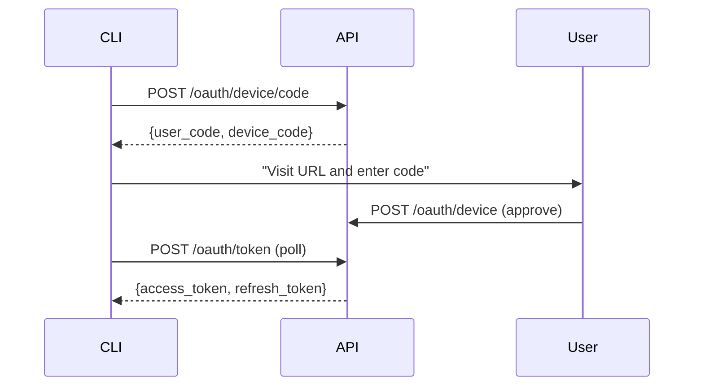
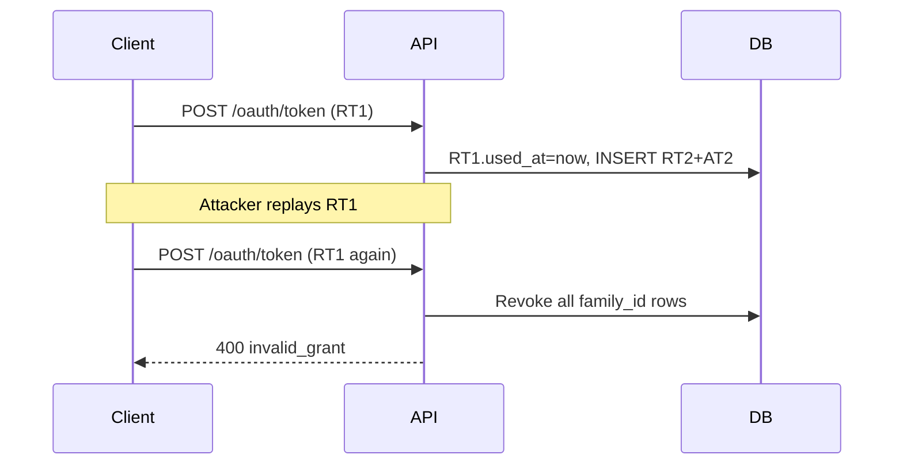

# Ship Platform — Architecture

## 1. System Overview

Ship is a monorepo (pnpm workspaces) containing four packages:
- `api/` — Express + PostgreSQL backend
- `web/` — React + Vite frontend
- `shared/` — Shared TypeScript types
- `sdk/` — Public TypeScript SDK (`@ship/sdk`)
- `integrations/cli/` — `ship` CLI binary

The public platform API (`/api/v1/*`) lives at `api/src/platform/` — a clean boundary that external integrations must use instead of internal routes.

```mermaid
graph TD
  CLI[ship CLI] -->|Bearer token| V1[/api/v1/*]
  SDK[@ship/sdk] -->|Bearer token| V1
  Browser[Browser PKCE SPA] -->|Bearer token| V1
  Slack[Slack Integration] -->|Webhook verify| SlackInt[integrations/slack]
  V1 --> Platform[api/src/platform/]
  Platform --> DB[(PostgreSQL)]
```

## 2. Public API Boundary

All external traffic enters `api/src/platform/api/v1/router.ts`. Middleware stack:
1. `requestId` — UUID per request
2. `auditLog` — writes to `public_api_audit` on response finish
3. `bearerAuth` — validates `oauth_access_tokens`, populates `req.auth`
4. `rateLimit` — token-bucket per `appId` (1000 req/min)

ESLint `no-restricted-imports` enforces that `api/src/platform/api/v1/**` cannot import from internal `routes/` or `services/`.

## 3. OAuth Flows

Three grant types are supported: Authorization Code + PKCE (`/oauth/authorize`), Device Authorization Grant (`/oauth/device/code`), and Refresh Token.



Key files: `api/src/platform/oauth/device.ts`, `api/src/platform/oauth/token.ts`, `api/src/platform/oauth/authorize.ts`

## 4. Refresh Token Rotation and Stolen Token Detection

Every `oauth_refresh_tokens` row carries a `family_id`. On exchange: old token's `used_at` is stamped; new pair inherits `family_id`. Reuse of a spent token revokes the entire family.



Key file: `api/src/platform/oauth/token.ts`

## 5. Webhook Pipeline

`InMemoryEventBus` is subscribed by `InMemoryWebhookDeliverer` at module load. Domain code calls `eventBus.publish(event)` after mutations. The deliverer queries matching `webhook_subscriptions` and POSTs signed payloads within 10s.

Signature format: `Ship-Signature: t=<unix>,v1=<hmac-sha256-hex>`

Key files: `api/src/platform/events/InMemoryEventBus.ts`, `api/src/platform/webhooks/HmacSigner.ts`, `api/src/platform/webhooks/InMemoryWebhookDeliverer.ts`

## 6. Retry, DLQ, and Replay

`WebhookRetryScheduler` processes `webhook_deliveries` rows due for retry. Schedule: `[1s, 4s, 16s, 1m, 5m, 30m]` ±10% jitter. 4xx responses (except 429) dead-letter immediately. After 7 attempts, the row is dead-lettered. Replay clears `dead_lettered_at` and preserves the original `idempotency_key`.

`FakeClock` enables sub-second retry unit tests with no real `setTimeout`.

Key files: `api/src/platform/webhooks/WebhookRetryScheduler.ts`, `api/src/platform/webhooks/IClock.ts`

## 7. Rate Limiting and Audit Trail

`TokenBucketLimiter` maintains an in-memory per-`appId` bucket (1000 req/min). All `/api/v1/*` responses write to `public_api_audit` including 401/403, capturing `client_id`, `user_id`, `route`, `scope_used`, `http_status`, `latency_ms`, `request_id`.

Key files: `api/src/platform/ratelimit/TokenBucketLimiter.ts`, `api/src/platform/middleware/rateLimit.ts`, `api/src/platform/audit/auditLog.ts`

## 8. SDK Architecture

`@ship/sdk` is a zero-dependency ESM package built from `sdk/src/`. Resource clients (`DocumentsClient`, `IssuesClient`, `SprintsClient`, `WebhooksClient`) all follow the same pattern: constructor takes `(baseUrl, token)`, methods return typed results, errors throw `ShipError` with `kind` discriminant.

`verifyWebhook(headers, rawBody, secret)` mirrors `HmacSigner.verify()` for use in any receiver. `AuthorizationCodeFlow` handles PKCE with `buildAuthorizationUrl()` + `exchangeCode()`.

Key files: `sdk/src/ShipClient.ts`, `sdk/src/webhook.ts`, `sdk/src/auth/AuthorizationCodeFlow.ts`

## 9. Deployment and CI

Backend deploys to Elastic Beanstalk via `./scripts/deploy.sh prod`. Frontend to S3/CloudFront via `./scripts/deploy-frontend.sh prod`. Migrations run automatically at startup via `api/src/db/migrate.ts`.

CI chain in `.github/workflows/plugforge.yml`:
```
f2 → f3 → f4 → f5 → f6 → f7 → f8 → f9 → f10 → f11 → f12 → f13
```

The grader token is seeded by `pnpm db:seed:grader` and injected into CI as `SHIP_GRADER_TOKEN`.
