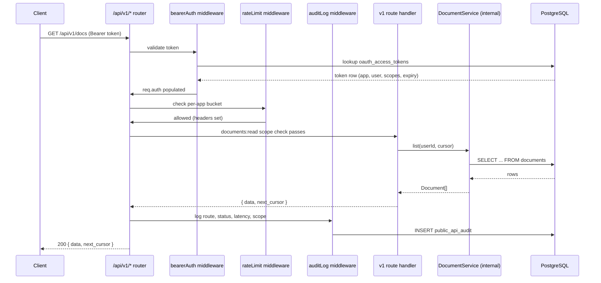
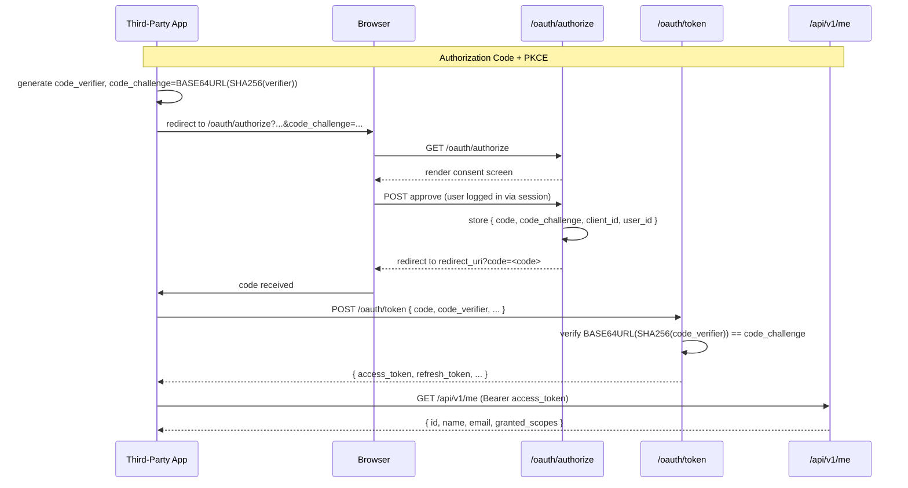
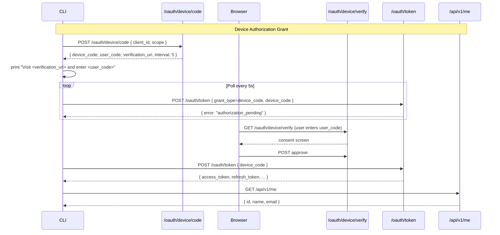
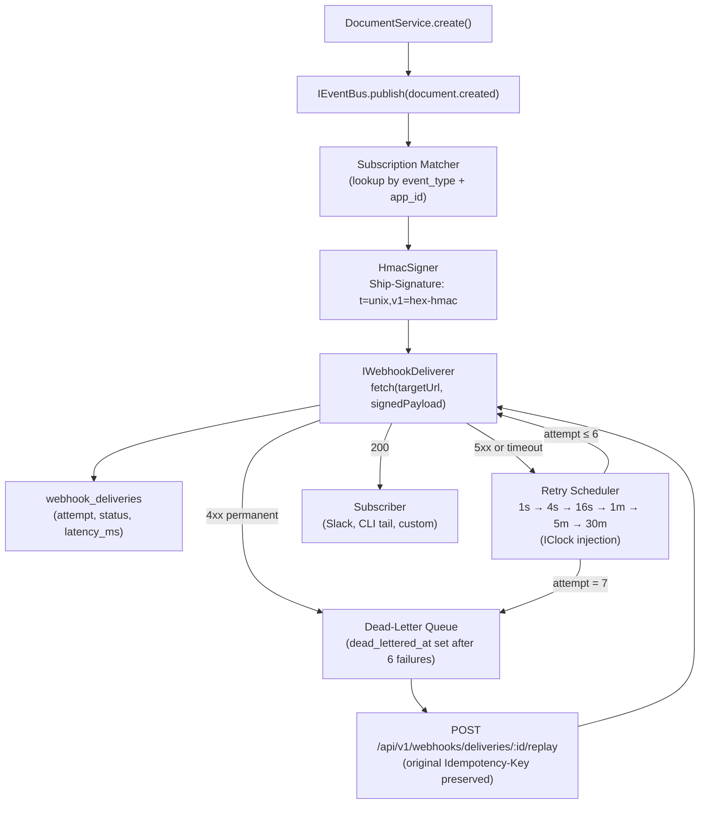
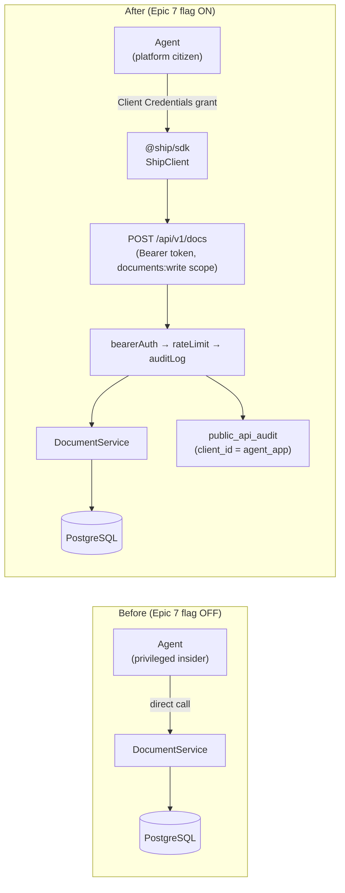

# Platform Architecture — Ship PlugForge

> Covers the platform layer added in the PlugForge sprint: OAuth 2.0, public REST API, HMAC-signed webhooks, TypeScript SDK, and agent-as-citizen rewire.
> Generated from architectural decisions locked in PLUGFORGE-PLAN.md.

---

## System Architecture

### Module Layout

```
api/src/
  platform/                    # All new platform code lives here
    apps/                      # OAuth app registration & management
    oauth/                     # Auth Code + PKCE, Device Grant, token exchange
    scopes/                    # ScopeRegistry — scopes-as-data
    ratelimit/                 # TokenBucketLimiter + IRateLimiter interface
    events/                    # IEventBus + InMemoryEventBus + event type schemas
    webhooks/                  # HmacSigner, IWebhookDeliverer, InMemoryDeliverer, retry scheduler
    middleware/                # bearerAuth, requireScope, rateLimit, auditLog, errorHandler
    errors/                    # ApiError class + ApiErrorCode union
    pagination/                # cursor encode/decode
    openapi/                   # registerRoute helper + spec generator
    audit/                     # public_api_audit write path
    api/v1/                    # Public route handlers (import only from platform/)
      routes/
        documents.ts
        issues.ts
        sprints.ts
        webhooks.ts
        me.ts
        apps.ts
        audit.ts
      router.ts                # Mounts all v1 routes; never imports from api/src/routes/

sdk/src/
  ShipClient.ts                # Entry point, static factory methods
  resources/
    DocumentsClient.ts
    IssuesClient.ts
    SprintsClient.ts
    WebhooksClient.ts
  auth/
    AuthorizationCodeFlow.ts
    DeviceFlow.ts
    ITokenStore.ts
  webhook/
    verifyWebhook.ts
  errors.ts                    # ShipError discriminated union
  types.ts                     # User, Document, Issue, Sprint, Webhook

integrations/
  cli/                         # ship binary — imports only @ship/sdk
  browser-demo/                # PKCE SPA demo
  slack/                       # Slack bolt integration
  drills/                      # stolen-token-drill.ts, idempotency-drill.ts
```

---

### Public / Internal Boundary



*Internal `/api/` routes call `DomainService` directly — no bearer auth, no audit log. The domain layer is shared; the contract layer attaches only at the public boundary.*

---

### OAuth Flows





---

### Webhook Pipeline



*The domain layer publishes events. The webhook pipeline is a platform concern that attaches at the service layer boundary — route handlers never call the event bus directly.*

---

### Agent-as-Citizen: Before / After



*After the rewire: the agent is subject to the same rate limits, scope checks, and audit trail as any external developer. The audit log row's `client_id = agent_app_client_id` is the proof.*

---

### Composition Root (`api/src/app.ts` wiring sketch)

> *Directional guidance — not implementation specification.*

```
// Production wiring
const clock        = new WallClock()
const eventBus     = new InMemoryEventBus()
const deliverer    = new InMemoryWebhookDeliverer(clock, webhookSubRepo, hmacSigner, deliveryLogRepo)
const rateLimiter  = new TokenBucketLimiter(clock)
const tokenStore   = new PostgresTokenStore(db)

eventBus.subscribe('*', deliverer.handle.bind(deliverer))

const v1Router = buildV1Router({ tokenStore, rateLimiter, eventBus, deliverer })

app.use('/api/v1', v1Router)
app.use('/oauth', buildOAuthRouter({ tokenStore }))
// internal routes mount as before ...

// Test wiring (in-process, no network)
const clock        = new FakeClock()
const eventBus     = new InMemoryEventBus()
const deliverer    = new SynchronousTestDeliverer()  // resolves immediately
const rateLimiter  = new NoopRateLimiter()
const tokenStore   = new InMemoryTokenStore()
```

*All dependencies injected at the composition root. No `new` calls inside handlers or services — every interface is swappable for testing.*

---

### SOLID Rationale

**Single Responsibility** — `api/src/platform/webhooks/HmacSigner.ts` signs only. `api/src/platform/middleware/auditLog.ts` writes audit rows only. `api/src/platform/middleware/errorHandler.ts` serialises errors only. Each class has exactly one axis of change.

**Open/Closed** — `api/src/platform/scopes/ScopeRegistry.ts` registers new scopes at module load via `ScopeRegistry.register()`. No middleware file is edited to add a scope; the registry is open for extension, closed for modification.

**Liskov Substitution** — `api/src/platform/webhooks/InMemoryWebhookDeliverer.ts` and a future `BullMQWebhookDeliverer` both satisfy `IWebhookDeliverer`. Swapping the implementation at the composition root requires no changes to any caller.

**Interface Segregation** — SDK clients are resource-segregated: `DocumentsClient`, `IssuesClient`, `SprintsClient`, `WebhooksClient`. `ShipClient` exposes them as readonly properties; consumers import only what they use.

**Dependency Inversion** — `DocumentService` depends on `api/src/platform/events/IEventBus.ts` (interface), not `InMemoryEventBus` (concrete). Both are injected at the composition root.
`api/src/platform/webhooks/InMemoryWebhookDeliverer.ts` depends on `api/src/platform/webhooks/IClock.ts`, never `Date.now()` — enabling deterministic tests via `FakeClock`.
---

### Failure Modes

**Token store corrupted:** Bearer validation fails → 401 on all requests. Recovery: reissue tokens via the OAuth flow. The token store (PostgreSQL `oauth_access_tokens`) is protected by the same backup/restore process as the documents table.

**Subscriber signing secret rotated mid-flight:** In-flight deliveries signed with the old secret are rejected by the subscriber (correct behavior — the old signature is invalid). The subscriber should re-subscribe with the new secret. The delivery log records the 400 response. No retries (4xx = permanent). Document: subscribers must update their secret before the operator rotates.

**Queue deliverer crashes mid-batch:** In-memory deliverer: deliveries in the queue are lost. At-least-once guarantee cannot be met without persistent queue storage. Document the production upgrade path: replace `InMemoryWebhookDeliverer` with `BullMQWebhookDeliverer` (same `IWebhookDeliverer` interface). No code changes outside the composition root.

**OpenAPI generator throws at boot:** Caught in `app.ts` try/catch. Server boots. `GET /api/v1/openapi.json` returns 503 `{ code: "server_error", message: "OpenAPI spec unavailable" }`. The CI fitness test (`openapi.test.ts`) catches generator errors before any deploy reaches production.

---

## Key Decisions Summary

| # | Decision | Choice | Locked |
|---|---|---|---|
| 1 | OAuth grant for agent | Client Credentials (RFC 6749 §4.4) | Yes |
| 2 | Refresh token rotation | One-time-use, family invalidation on reuse | Yes |
| 3 | What gets signed in webhooks | `t=<unix>.<rawBody>` (timestamp + body concat) | Yes |
| 4 | 4xx vs 5xx permanence | 4xx permanent (except 429), 5xx + 429 transient | Yes |
| 5 | SDK generation strategy | Hand-written + OpenAPI fitness test | Yes |
| 6 | Cursor pagination | Keyset `(created_at, id)` — stable under reorder | Yes |
| 7 | Portal uses public API | Yes — no internal escape hatch | Yes |
| 8 | Webhook payload content | ID + event type only (no full document body) | Yes |
| 9 | Delivery semantics | At-least-once with idempotency keys | Yes |
| 10 | Field-level filtering | Skipped (YAGNI) | Yes |
| 11 | Versioning past v1 | Additive only in v1; breaking changes via v2 | Yes |
| 12 | Consent screen CSRF | `state` parameter (RFC 6749 §10.12) | Yes |
| 13 | In-memory deliverer ceiling | Cap at 500 in-flight; beyond = dead-letter | Yes |
| 14 | Webhook log retention | 30 days (env `WEBHOOK_DELIVERY_RETENTION_DAYS`) | Yes |
